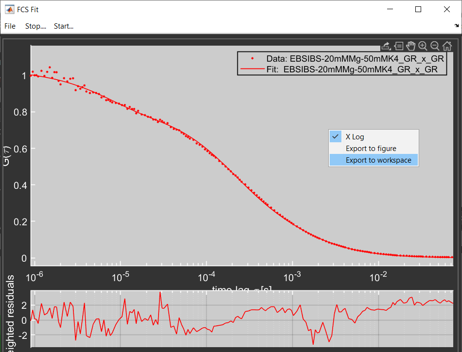

MatPAM
======

Introduction
------------

Extract 2D histograms
*********************

From PAM's BurstExplorer module draw a new Matlab figure window with a 2D histogram by right-clicking on the plot and selecting `Export 2D`. 

.. image:: _static/extract_2Dplot.png
    :width: 500
    :align: center

From the Matlab console run: ::

    extract_2Dplot
    
    # you may also add additional parameters to be included in the output json file
    extract_2Dplot('photons_per_window', 5)

Currently implemented name-value pairs are:
- photons_per_window (int)
- crosstalk (float)
- direct_excitation (float)
- gamma_factor (float)

Export FCS fit results
**********************

From PAM's FCSfit module right-click on the plot and select `Èxport to workspace`.

From the Matlab console run: ::

    write_FCS(FCS)

Extract timetrace
*****************

From PAM's main window right click on the intensity time trace and select `Export`.

.. image:: _static/extract_timetrace.png
    :width: 500
    :align: center

From the Matlab console run: ::
    
    extract_timetrace

    # specify start and end times (in s)
    extract_timetrace('start_time', 0.001, 'end_time', 1)