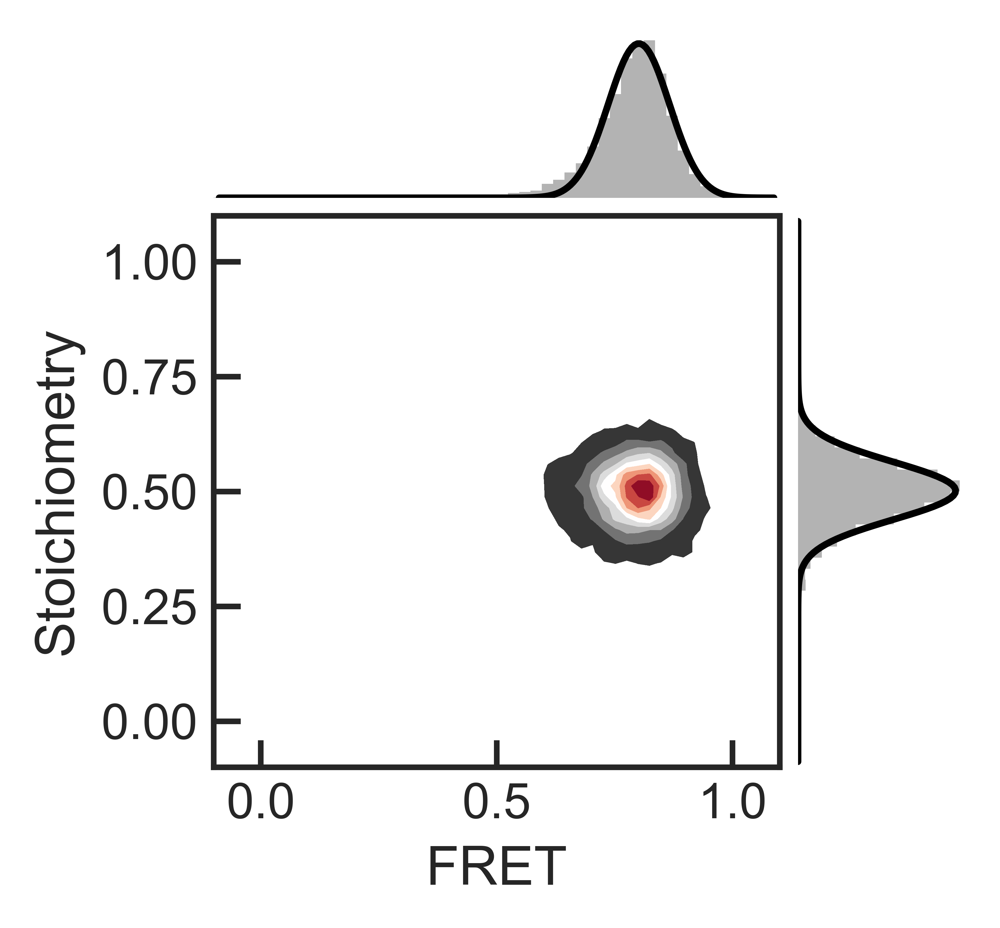

PyPAM
=====

Introduction
------------

The module `pamplot.py` implements functions to load .json formatted 2D data from PAM's BurstBrowser. An example experiment can be found in the PyPAM :doc:`tutorial <tutorial/pamtools_tutorial>`

Module description
------------------

.. automodule:: pypam.pamplot
   :members:
   :undoc-members:
   :show-inheritance:
